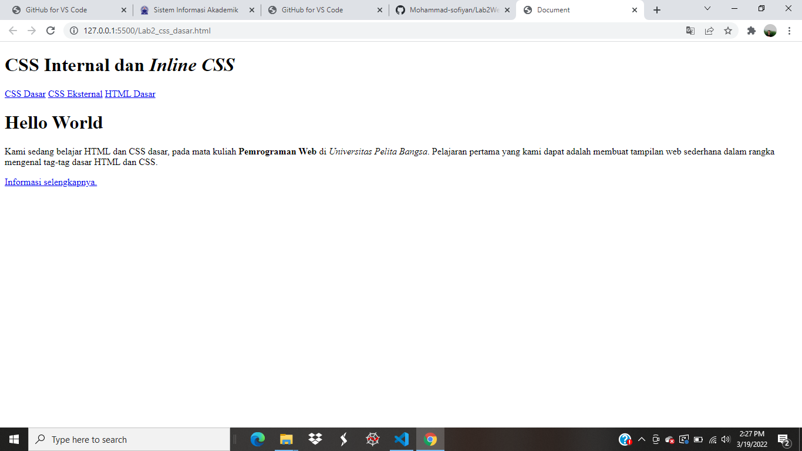
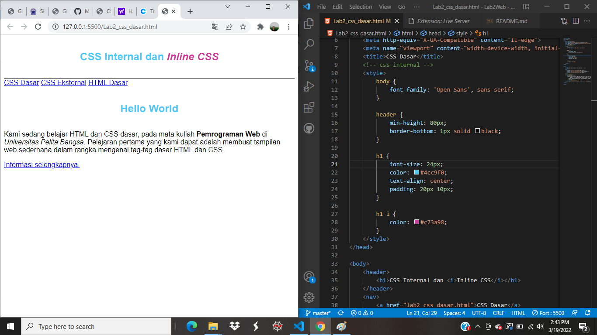
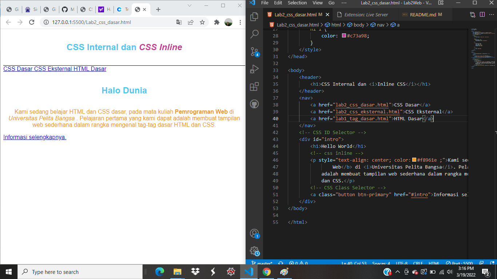
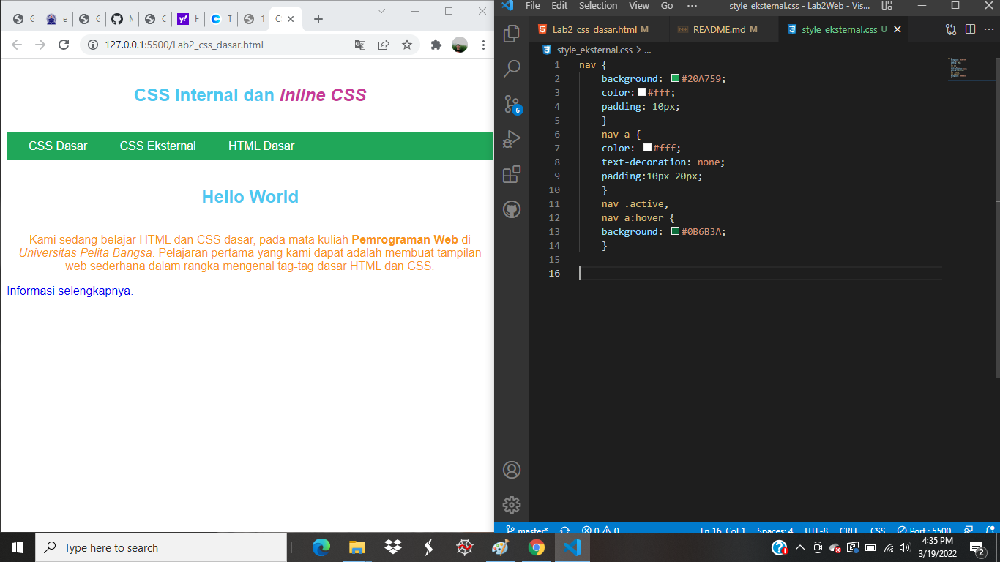
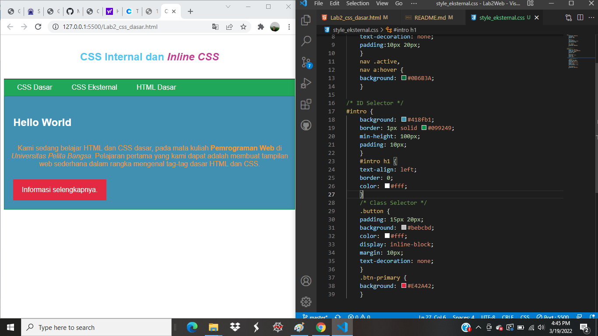

|Mohammad Sofiyan | 312010225   |
|---------------- |------------ |
| program web     | TI.20.A2    |

### PERTEMUANM 3

# LAB2WEB

## 1). MEMBUAT DOKUMEN HTML 

Disini adalah sebuah dokumen html namun belum terdapat file css internal, inline dan eksternal kareana sebuah file html saja dan belum  diberikan gaya pada css. 

## 2). MENAMBAHKAN CSS INTERNAL 

css internal adalah css yang filenya terdapat di dalam dokumen html dengan deklarasi style tepat di dalam head pada html.

## 3). MENAMBAHKAN INLINE CSS 

ccs inline adalah css yang memiliki prioritas yang terkuat dibanding internal dan eksternal.

## 4). MENAMBAHKAN CSS EKSTERNAL

CSS EKSTERNAL adalah css yang filenya terdapat diluar HTML dan diberi tautan link di dalam HTML agar terhubung dengan css dan merubah gaya dengan eksternal file eksternal css dapat digunakan banyak HTML itulah keunggulan dari css **eksternal** 

## CONTOH CODE DAN HASIL BROWSERNYA 

## MENAMBAHKAN CSS SELECTOR 

CSS selector adalah css yang pendeklarasiannya unik, seperti contoh jika **ID** yaitu dengan mengunakan **#** sedangkan **CALSS** menggunakan **.** dan hanya pada bagian yang di beri  **ID** dan **CLASS** saja yang akan berubah di file HTML nya ketika diberi gaya pada CSS.

## CONTOH CODE DAN HASILNYA 

